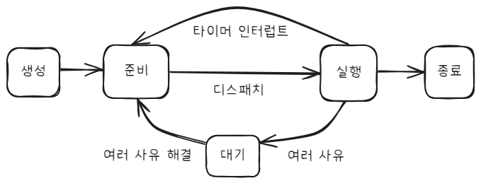

## CH09 운영체제  
### 09-1 운영체제를 알아야하는 이유  
#### 운영체제란  
컴퓨터 세상의 정부(=government) 역할을 한다. 인적, 물적 자원들을 행정처리하는것 처럼  

컴퓨터 자원을 컨트롤 타워 역할을 한다.  

물론 기계적으로 보면 명령어를 해석하여 메모리에 올리고, 어떻게 연산하고 하는거는 전부 CPU의 몫이다.  

그런데 말이다. 그 CPU를 다이렉트로 사용자 소프트웨어가 컨트롤해야되는 상황이라고 치자.   

사용자마다 입출력장치의 레지스터 명령어가 다르고, 사용자마다 CPU연산은 다르면 어떻게 컨트롤할건데, 일반 응용프로그램이 대체 얼마나 무거워지고 개발자 죽어난다.   

그래서 컨트롤 타워 역할을 알하서 하는 소프트웨어가 운영체제  

#### 운영체제를 알아야하는 이유  

컴퓨터 공학을 공부하는 이유... 만능 답안 결국 컴퓨터 세상의 문제해결을 위해서.  

#### 확인문제  

1. 시스템 자원
2. 2번

---

### 09-2 운영체제의 큰 그림  

#### 커널  

주기억 장치는 현재 실행중인 모든 프로세스가 다 올라오는 공간이다.   

이는 운영체제에도 예외는 아님. 운영체제도 메모리에 올라와야 비로소 동작하는 것.  

이렇게 운영체제같은 핵심 프로그램은 특수한 공간에 올라오는데 그 특수하게 지정된 공간 `커널` 영역이다.  

운영체제의 모든 기능들이 다 커널에서 제공되는건 아니다. 커널외 `사용자공간`에 적재된 기능도 존재하는 데 바로 사용자와 직접 `상호작용`하기 위한 기능인 `UI` 기능이다.  

이건 외우는게 아니다. 자연스러운 흐름이다. 사용자가 함부로 건들지 못하게 하기 위해 `커널`에 적재해야하는 기능이 있는거고, 사용자가 건드려야하는 `사용자 영역`에 적재헤야되는 기능이 있는것  

UI는 크게 `GUI` 와 `CLI` 방식으로 나뉜다. 전자는 그래픽 인터페이스로 마우스나 터치로 클릭하여 반응하는거고, 후자는 커맨드라인이라는 명령어 입력을 직접하여 기능을 동작시키는 인터페이스  

#### 이중 모드와 시스템 호출  

앞서 `커널`은 사용자의 조작, 응용프로그램의 조작으로부터 안전하게 분리시키기위한 영역이라고 했다. 하지만, 적재만하고 전혀 사용하지 않으면 무슨 소용인가.  

그래서 커널영역안의 코드기능을 사용하고자 할때 시스템 콜을 이용하여 운영체제에게 기능 요청을 하게된다.  

이 때 시스템 호출을 통해 하는 것이 `모드 전환` 이다. `커널 모드` 와 `사용자 모드` 두 가지 모드를 통칭하여 이중 모드라고 하고, 커널모드를 획득해야 비로소 커널 기능을 받아 사용할 수 있게 된다.  

시스템 호출은 인터럽트 방식으로 동작한다. 인터럽트 체크는 새로운 클럭신호에 체크된다. 보내놓고 응답하여 처리하고 다시 돌아오고 방식으로 작동한다는 것.  

#### 운영체제의 서비스  

CPU, 메모리, 입출력장치에 이르기까지 사실상 하드웨어를 컨트롤하기 위한 모든 기능은 전부 다 관리한다고 보면 된다. 하드웨어를 관리한다는것 자체가 바로 컴퓨터의 동작이다.  

#### 가상 머신과 이중 모드의 발전  

VM(=Virtual Machine)은 운영체제 위에 또 다른 운영체제 서비스를 구동시키는 것.  

제2의 운영체제도 하드웨어가 있어야 돌아간다. CPU, Memory, 입출력  

이걸 관리하는 놈은 제1의 운영체제이다.   

따라서 제2의 운영체제도 응용프로그램마냥 계속해서 이중모드 컨트롤 인터럽트를 사이클을 반복하며 마치 자기가 컨트롤하고 있는듯이 동작하게 된다.  

#### 시스템 호출의 종류  

| 종류             | 시스템 호출 | 설명                  |
| ---------------- | ----------- | --------------------- |
| 프로세스 관리    | fork()      | 새 자식 프로세스 생성 |
|                  | exit()      | 프로세스 종료         |
|                  | execve()    | 프로세스 실행         |
| ----             | ----        | ----                  |
| 파일 관리        | open()      | 열기                  |
|                  | close()     | 닫기                  |
|                  | read()      | 읽기                  |
|                  | write()     | 쓰기                  |
|                  | stat()      | 파일 정보 조회        |
| ----             | ----        | ----                  |
| 디렉터리         | mkdir()     | 메이크 디렉터리       |
|                  | rmdir()     | 리무브 디렉터리       |
| ----             | ----        | ----                  |
| 파일 시스템 관리 | mount()     | 파일 시스템 마운트    |
|                  | umount()    | 파일 시스템 언마운트  |
||||  

#### 확인 문제  

1. 커널
2. 4번
3. 3번은 커널 영역은 아니라서 핵심 서비스가 아니라 하는 것 같다.  

 

---
---

 

## CH10 프로세스와 스레드  

### 10-1 프로세스 개요  

#### 프로세스  

프로세스: 각자 기능을 맡아 정해진 일을 수행하는 프로그램  

실행중인 프로세스: 메모리 자원을 할당 받고, 각기 다른 사이클로 시스템 자원을 빨아먹어가며 돌아가는 프로세스들  

확인방법: 유닉스는 ps명령어, 윈도우는 작업관리자  

포그라운드 프로세스: foreground process
기능을 수행하는게 현재 관측되는 앞에 나와 기능하는 모든 프로세스  

백그라운드 프로세스: background process
뒤에 숨어서 일을 수행중인 프로세스  

데몬과 서비스: 백그라운드 프로세스 방식 중에서 사용자와 상호작용이 불가능하며, 주어진 상황따라 묵묵히 자기 일을 하는 프로세스  

#### PCB  

Process Control Block == 프로세스 제어 블록
프로세스와 관련한 정보들이 저장된 데이터 블록이다. 메모리에 적재된다.  

프로세스의 탄생시간이나, 프로세스 아이디값, 프로세스의 메모리 주소, 필요한 입출력장치 등 동적으로 잘 바뀌지 않는 정보들이 프로세스 탄생시에 기입되기도 하지만,  

PCB에는 시시각각 변하는 정보들도 여기에 기입된다. 이는 `문맥교환`을 위한 필수적인 정보들이며, CPU가 인터럽트를 처리할때, 다른 프로세스들에 잠깐 들렸다가 올때 등등 실행중이던 프로세스가 정상 작동할 수 있게 하는 아주 중요한 핵심 동작 원리이다.  

문맥에 따라 의미가 바뀌는 단어처럼. 프로세스도 현재 상태, 레지스터 값, 사용한 파일 등등 CPU입장에선 문맥이 바뀌고, 프로세스 입장에선 자기 자신 문맥을 보호하기위한 방법이 PCB에 싸그리 저장 때려 박는 방식인것  

#### Context Switching  

문맥교환  

이미 위에 설명을 다 해버렸는데, CPU가 동시에 멀티 프로세스 작업을 하는 것 처럼 보이는 이유는 PCB에 문맥정보를 저장하고, 실시간으로 빠르게 문맥들을 교환해가며 모든 프로세스들을 컨트롤하기 때문이다.  

중요한걸 빼먹었는데 PCB는 핵심적인 기능인 만큼 커널영역에 저장되어 있다. 응용프로그램이 함부로 바꾸지 못하게. 철저하게 운영체제가 관리  

#### 프로세스와 메모리  

프로세스는 운영체제와 달리 `사용자 영역`에 자리 잡는다. 이런 프로세스는 내부적으로 `코드영역`, `데이터 영역`, `힙 영역`, `스택 영역`으로 나뉜다.  

코드 영역: CPU가 실행할 명령어들의 집합  

데이터 영역: 프로세스부터 사용할 데이터가 미리 적재되어 항시 참조가능한 데이터들의 집합  

힙 영역: 프로그래머에 의해 상황따라 동적으로 변수를 만들고, 데이터를 누적한다면 바로 이 영역에 쌓여 올라간다  

스택 영역: 힙영역과 거꾸로 아래로 누적되어 쌓여가는 구조이다. 동적으로 필요한 데이터들이 생겨나서 push되고 역할끝나면 바로 pop되어서 사라지는 영역. 주로 지금 호출되고 있는 함수의 지역변수, 매개변수, 함수주소 등이 그 예시. 호출되서 반환하면 뭐하겠어? 사라지겠지.  

코드+데이터 = 정적 할당 영역
힙 + 스택 = 동적 할당 영역  

#### 확인 문제  

1. 4번
2. 1번

  

### 10-2 프로세스 상태와 계층 구조  

#### 프로세스 상태  

`생성상태`, `준비상태`, `실행상태`, `대기상태`, `종료상태`  

각각에 대한 설명  

생성상태: 메모리에 올라가고 PCB 작성된 따끈한 상태  

준비상태: CPU 사용준비 완료. 차례가 오길 기다려.  

실행상태: CPU가 받아들여줬어. 열심히 작업을 막해  

대기상태: CPU를 사용할 수 없는 상태. why? 일반적으론 입출력장치 문제인데, 입출력장치의 완료 신호를 기다리는 상태이다  

종료상태: 찐 종료. 이 상태는 오래 있지 않다. 상태전환되자마자 메모리에서 아웃되며, 빠르게 리스트에서 지워짐  

다이어그램
  

#### 프로세스 계층 구조  

프로세스는 그냥 바닥에서 부터 평등하게 시작하는게 아니다. 프로세스를 호출한 녀석이 부모 프로세스가 되어 링크드 리스트 혹은 실제 프로그램의 함수호출 구조 마냥 부모 프로세스 자식 프로세스가 쌓여간다.  

단순한 바탕화면에서 브라우저를 더블클릭하는 거 자체도 운영체제라는 부모 프로세스가 자식프로세스인 브라우저를 생성한거고  

브라우저가 배너를 클릭하니, pc의 소프트웨어 런처가 실행될때에는 브라우저가 부모 프로세스가 되는 형태이다.   

최초의 프로세스가 모두의 부모 프로세스가 되는 경우는 있지만, 최초의 프로세스를 제외한, 다른 모든 프로세스에 부모 프로세스가 없는 경우는 없다.  

#### 프로세스 생성 기법  

결론: 복제와 옷 갈아입기 방식을 사용한다.  

부모 프로세스는 자기 자신을 복제품을 일단 만들고, 이후 자식 프로세스에 필요한 PCB, 코드영역 데이터영역을 채워가며 프로세스를 생성상태를 만들어낸다.  

fork() :복제-> exec(): 덮어쓰기  

#### 확인문제  

1. 생성상태, 준비상태, 실행상태, 종료상태, 대기상태
2. 로그인 프로세스, vim 프로세스, bash 프로세스
3. 1번
4. 4번  

### 10-3 스레드  

#### 스레드란  

#### 멀티프로세스와 멀티스레드

 

---

 

## CH11 CPU 스케줄링

### 11-1 CPU 스케줄링 개요

#### 프로세스의 우선순위

#### 스케줄링 큐

#### 선점형과 비선점형

### 11-2 CPU 스케줄링 기법

#### FCFS

#### SJF

#### RR

#### SRT

#### PQ

#### MLQ

#### MFQ